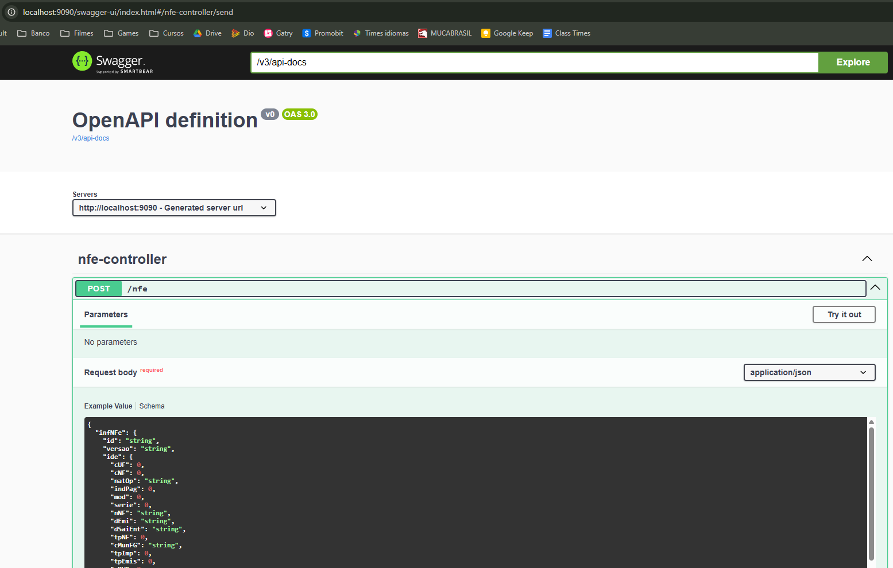
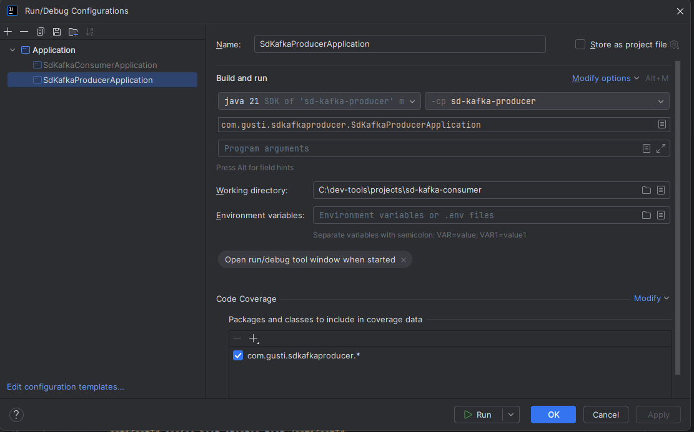
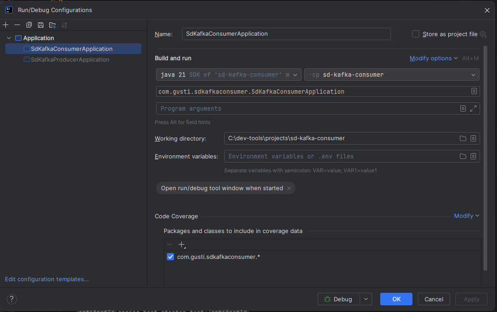

<h1 align="center">
  Dfe - Microservice Development Exercise
</h1>
<p align="center">
  
  <a href="https://github.com/gustavocarvalhoti/kafka-dynamo-java/commits/main">
    
  </a>
 <br>
  <a href="https://www.linkedin.com/in/gustavocarvalho-ti/">
      
  </a> 
</p>
<strong>
<br>
<p align="center">
  <a href="#bookmark-sobre">Sobre</a>&nbsp;&nbsp;&nbsp;|&nbsp;&nbsp;&nbsp;
  <a href="#computer-tecnologias">Tecnologia</a>&nbsp;&nbsp;&nbsp;|&nbsp;&nbsp;&nbsp;
  <a href="#wrench-ferramentas">Ferramentas</a>&nbsp;&nbsp;&nbsp;|&nbsp;&nbsp;&nbsp;
  <a href="#package-instalação">Instalação</a>&nbsp;&nbsp;&nbsp;|&nbsp;&nbsp;&nbsp;
  <a href="#memo-license">License</a>
</p>
</strong>
<br>

## :bookmark: Sobre

Json Messaging and Database Persistence using Kafka (Consumer and Producer) <br>
<br>

<p align="center">
    
</p>

## :computer: Tecnologias

- **[Java 21](https://www.oracle.com/br/java/technologies/downloads/#java21)**
- **[Kafka](https://kafka.apache.org/)**
- **[MongoDB](https://www.mongodb.com/)**
- **[Maven](https://maven.apache.org/)**
- **[Docker](https://www.docker.com/)**
- **[Docker Hub](https://hub.docker.com/)**
- **[Springframework](https://spring.io/projects/spring-framework)**
- **[Lombok](https://projectlombok.org/)**
- **[Spring-boot-devtools](https://docs.spring.io/spring-boot/reference/using/devtools.html)**
- **[Swagger](https://swagger.io/)**
- **[Mapstruct](https://mapstruct.org/)**

<br>

## :wrench: Ferramentas

- **[IntelliJ](https://www.jetbrains.com/)**
- **[Insomnia](https://insomnia.rest/)**
- **[Google Chrome](https://www.google.com/chrome/)**

<br>

## :package: Instalação

### :heavy_check_mark: **Pré-requisito**

Instalar os softwares abaixo:

- **[Git](https://git-scm.com/)**
- **[Maven](https://maven.apache.org/)**
- **[Docker](https://www.docker.com/)**

Rodar os comandos abaixo para criar os containers Docker:

````
#Config Kafka
docker pull apache/kafka:4.0.0
docker run -p 9092:9092 apache/kafka-native:4.0.0

#Install Mongo
docker pull mongo
docker run -d -p 27017-27019:27017-27019 --name mongodb-test mongo
#Acessar o container
docker exec -it mongodb-test bash

#Testando Mongo - Dentro do container
mongosh
show dbs
use nfe
show tables
db.nfe.find()
````

<br>

### :arrow_down: **Clonando o repositório**

```sh
  $ git clone https://github.com/gustavocarvalhoti/kafka-dynamo-java.git
```

<br>

### :arrow_forward: **Executando a aplicação (Producer)**

- :package: API

<br>

### :arrow_forward: **Executando a aplicação (Consumer)**

- :package: API

 <br>

## :memo: License

This project is under the **MIT** license.